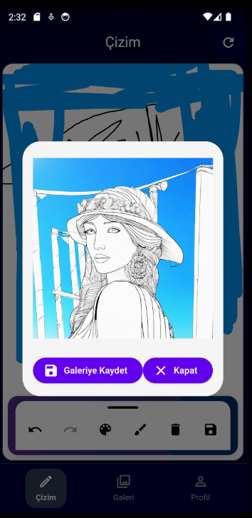
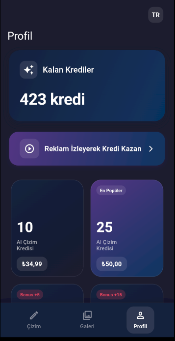
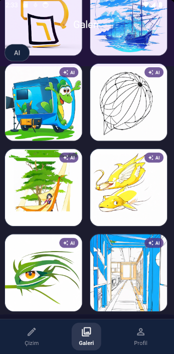

# DreamDoodle

A Flutter application that allows users to create drawings and transform them into realistic images using artificial intelligence.

## Screenshots

<div style="display: flex; justify-content: space-between;">
    
    
    
</div>

## Features

- Free-hand drawing
- Various color and thickness options
- Eraser tool
- Undo functionality
- Save drawings
- Transform drawings into realistic images using AI
- Save transformed images
- Credit system for AI transformations
- Earn credits by watching ads
- Premium membership options

## Installation

1. Install Flutter (https://flutter.dev/docs/get-started/install)
2. Clone the repository
```bash
git clone https://github.com/omerfarukx/ai-drawing-converter
```
3. Install dependencies
```bash
flutter pub get
```
4. Set up your API key
   - Create `lib/core/config/api_config.dart` file
   - Add the following content:
```dart
class ApiConfig {
  static const String apiKey = 'YOUR_API_KEY';
  static const String baseUrl = 'YOUR_API_BASE_URL';
  static const String imageToImageEndpoint = 'YOUR_ENDPOINT';
}
```

## Usage

1. Use the screen to draw
2. Select color and thickness from the toolbar on the left
3. Use the save button to save your drawing
4. Click the AI button for AI transformation
5. Use the save button to save the generated image

## Contributing

1. Fork this repository
2. Create your feature branch (`git checkout -b feature/amazing-feature`)
3. Commit your changes (`git commit -m 'feat: Add some amazing feature'`)
4. Push to the branch (`git push origin feature/amazing-feature`)
5. Create a Pull Request

## License

This project is licensed under the MIT License - see the [LICENSE](LICENSE) file for details.
